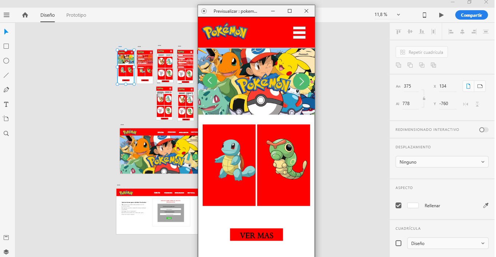
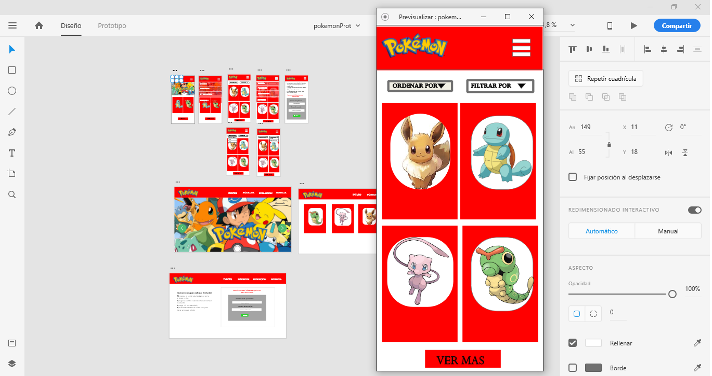
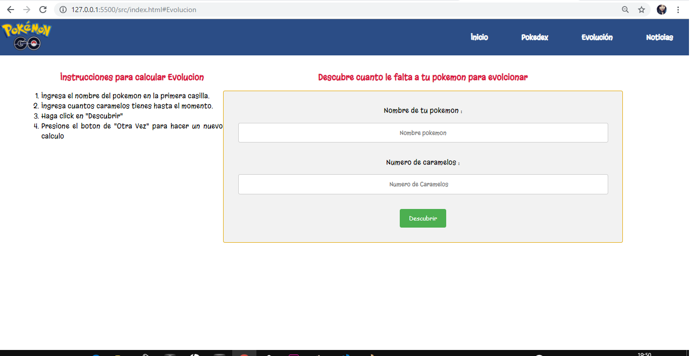

# POKEMON 
## Introducción
Pokemon Go es un videojuego de aventura de realidad aumentada, creado por Niantic, Inc. para dispositivos iOS y Android.Desde el día de su lanzamiento a causado furor entre los jóvenes y adultos.De acuerdo con el concepto original, los entrenadores buscan capturar Pokémon hasta completar una colección. El otro objetivo es adiestrarlos para que ganen batallas frente a otras criaturas. El juego ha conseguido superar los 65 millones de usuarios al día y ha generado aglomeraciones en las ciudades. Pero, ¿por qué este juego ha causado tanto impacto en los usuarios? La idea de llegar a convertirse en un maestro Pokémon es un feeling con el que ha crecido toda una generación, Pokémon Go te permite vivir la experiencia de un verdadero entrenador pokémon.

## Pokemon - Data Lovers 
Es una herramienta de ayuda para todos los usuarios de Pokémon Go, ya que te permite hacer, desde una búsqueda específica de un Pokémon, filtrarlos por tipo y evolución. Hacer un cálculo real de caramelos que le falta a tu Pokémon para llegar a la siguiente evolución.

## Definición del Producto

**¿Quiénes son los principales usuarios de producto?**
Los principales usuarios son los jugadores tanto nuevos como antiguos de Pokémon Go.

**¿Cuáles son los objetivos de estos usuarios en relación con tu producto?**
Buscar Pokémon en específico y conocer datos sobre ellos 

**¿Cómo crees que el producto que estás creando está resolviendo sus problemas?**
Nuestro producto facilíta la búsqueda de pokemon ,ademas ayuda a que estos puedan saber cuantos dulces le falta al pokemon para su siguiente evolucion.

## Historias de Usuarios
Con el objetivo de conocer las verdaderas necesidades de los usuarios que estan inciando en el juego de  POKEMON GO decidimos realizar una pequeña encuesta que fue de gran utilidad para conocer los primeros pasos a dar antes de desarrollar el producto.Encontramos que nuestros usuarios necesitaban lo sieguiente puntos basicos :

Mostrar Data: Según usuarios desean que se muestre por defecto en la web al ingresar solo información relevante como el numero de pokedex ,la imagen y el nombre, para que sea más ordenada y simple de usar.

Filtrar Data: Los usuarios indicaron que les gustaría un filtro por tipo de pokemon y tambien por evolcion ,ya que al conocer esta información les sería útil antes de empezar a jugar Pokemon GO.

Ordenar Data: Usuarios desean que se les permita ordenar la data de manera alfabética ascendente(A-Z) y alfabética descendente(Z-A) ,y tambie por el mayor numero de apariciones  ya que les ayudaría a encontrar más rápido el pokemón que les interesa.

Calcular Data:Los jugadores de Pokémon GO indicaron que les ayudaría en sus decisiones tener el calculo de cuantos duceles le falta a un pokemon para su evolucion

##Encuestas 

## Diseño de la Interfaz de Usuario
En funcion a las necesidades nuestros usuario indicaron en la encusta se desarrollo un prototipo de baja fidelidad y un prototipo de alta fidelidad.

### Prototipo de baja fidelidad
Se realizó siguiendo como pauta las historias de usuario que resultaron de las encuestas a los jugadores de Pokemón GO .
####Sketch1

####Sketch2

####Sketch3

### Prototipo de alta fidelidad
para el prototipo de alta fidelidad desidimos usar Adobe XD que es una herramienta que nos parecio mas amigable y nos permitio exportar el diseño a Zeplin

Diseño en Zeplin [Enlace Zeplin](https://zpl.io/bLP84JB)

POkEMON GO es una pagina web que se centra en otorgarle al los jugadores y conocedores del juego puedan informarse acerca de sus pokemones segun su tipo etapa de evolucion.
### PRIMERA VISTA

### SEGUNDA VISTA

### TERCERA VISTA

### CUARTA VISTA

### QUINTA VISTA

### SEXTA VISTA

### SEPTIMA VISTA

